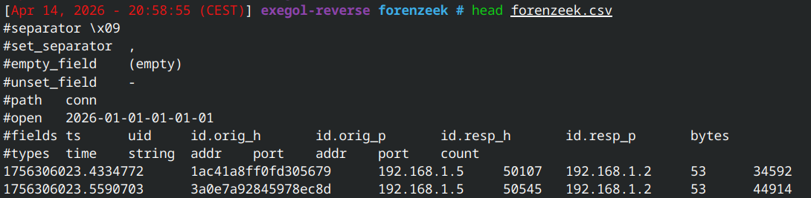

+++
date = '2026-04-15T11:34:21+02:00'
title = 'Forenzeek'
draft = false
categories = ["Forensic"]
tags = ["Medium"]
description = "Challenge de Forensic du FCSC 2026"
+++

# Forenzeek

Pour ce challenge, nous avons accès à des logs réseau collectés à l'aide de [Zeek](https://docs.zeek.org/en/master/scripts/base/protocols/conn/main.zeek.html#type-Conn::Info) desquels nous n'avons que quelques informations: 

- Le timestamp
- Le UID
- Les IPs d'origine et de destination
- Les Ports d'origine et de destination

## Challenge 1 - Compromission initiale
Nous avons comme informations qu'une compromission a été détectée sur la machine `192.168.1.42` et que cela vient d'un email malveillant qui comporte une charge utile d'une grande taille. Le but est de trouver l'uid du paquet concernant le téléchargement.

On commence alors par mettre de côté uniquement les données qui concernent la machine compromise:

Nous pouvons voir que malgré le filtrage, nous avons plus de 2000 lignes sur cette IP.

Nous savons que la compromission vient d'un email compromettant, on peut alors filtrer par les ports concernant des services de mail, IMAP, POP, SMTP...

On peut alors voir un paquet d'une taille assez conséquente qui pourrait totalement être un exécutable téléchargé avec le protocole IMAPS.

Nous avons le premier flag !

## Challenge 2 - Latéralisation

Pour la suite de ce challenge, nous avons l'information que depuis cette machine, il y a eu une compromissions de la machine administrateur. Nous devons ici trouver l'UID de connexion à la machine administrateur.

Nous n'avons pas plus d'informations, ni même l'adresse IP de la machine administrateur. 

Cependant, dans la description il est utilisé le mot "connexion" et "latéralisation", on peut alors directement penser à un service permettant d'avoir un accès direct à la machine de l'administrateur: SSH, mais aussi potentiellement de l'evironnement Windows donc WinRM et RDP. 
On peut bien entendu réutiliser notre csv avec la première IP:

On a seulement 2 connexions en WinRM dont une seule depuis la .42. 

Nous avons le deuxième flag !
