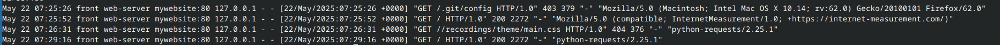
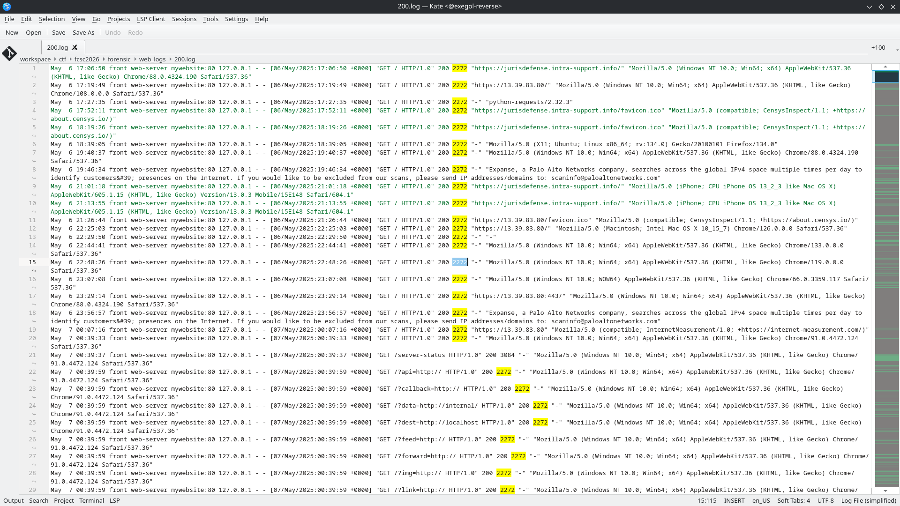
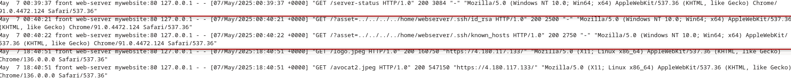

+++
date = '2026-04-15T11:33:31+02:00'
title = 'Web Logs'
draft = false
categories = ["Forensic"]
tags = ["Medium"]
description = "Challenge de Forensic du FCSC 2026"
+++

# Web Logs

Nous avons ici accès à des logs provenant de syslog depuis un serveur web.

Nous devons trouver une attaque qui a permis à un attaquant d'extraire des fichiers sensibles, nous devons renseigner la CWE et les fichiers extraits

Nous avons plusieurs façons d'analyser ces logs, nous pouvons utiliser des tools comme ELK ou Graylog. Ou alors simplement utiliser du CLI ! 

Je suis parti du principe qu'il fallait trouver des requêtes avec une grande taille de données. 

En regardant les requêtes avec une réponse positive, la plupart réponses font une taille de 2272 qui a l'air d'être la taille de la page par défaut:

```bash
awk '$15 == 200' webserver.log > 200.log
```



On peut alors prendre tous les logs avec une taille supérieure à 2272:

```bash
awk '$16 > 2272' webserver.log > big.log
```

On trouve assez rapidement deux éléments étranges:


On peut voir que l'attaquant utilise une Path Trasversal ([CWE-35](https://cwe.mitre.org/data/definitions/35.html)) et il a exfiltré une clé privé et les known hosts.
